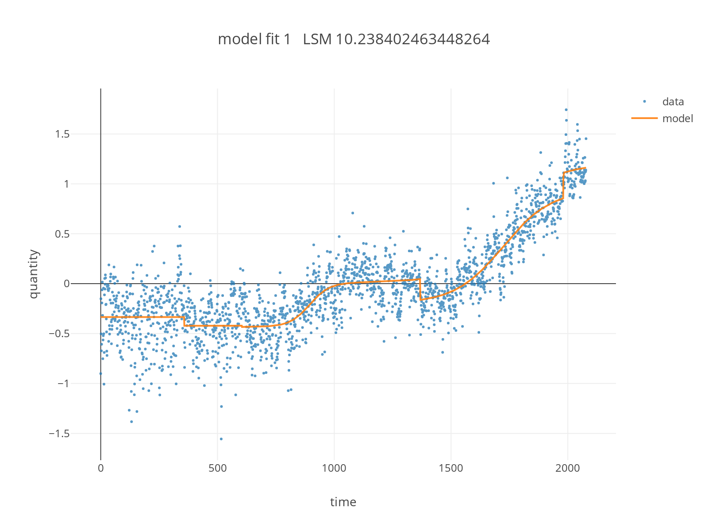

# Humpty, a flexible model for adaptive and changing growth processes.
W. Casey, L. Metcalf, H. Janwa, E. Battifarano, S. Chatterjee, A. Edwards

Numerical Method to comprehend/approximate Chang-points caused by spontaneous changes to capacity and rates
(c) 2023-2024 W. Casey

<div style="text-align: center;">

<p>
Climate change data and adaptive model.
</div>

Humpty is a flexible model for data generated by a mixture of multiple nonlinear growth components.
In the demonstration below the growth modules are logistic equations featuring growth rate and capacity parameters. 
This model enables the detection of change to the growth parameters, by detecting an increasing skewness signal in the residual, the model can identify when its time to include another component to better fit predictions going forward.   
As such the model can also be considered a change point detection for a mixture model with fixed form. 

# Quick Start 
## Building the software
The humpty tools and system is built in the Rust programming language.
To compile the code you will need to run the following in the top level directory
> cargo build --release

## generate some model data.
Humpty can be used to construct exemplar data. 

You can generate model with given parameters: 
> ./target/release/humpty gen tanh -e1.0 -t140 x.csv "70.,60.5,0.03,30,120,-0.03" 

This step should produce the following output files in your working directory: 
* x.csv  
* x_model.yml

## fit data using the model.

Now with data in hand you can estimate the parameters of a humpty model with:

> ./target/release/humpty fit xtilde x.csv

Or you can perform fits with specific subsequences of data and specified number of hump components, to report a certain number of top fitting models:

> ./target/release/humpty fit -n5 -o40 -l80 -r10 xtilde_partial x.csv

You can view all of the options by typing:
> ./target/release/humpty fit

```text
use nonlinear least squares fitting for data against a specified class of models

Usage: humpty fit [OPTIONS] <OUTPUT> <INPUT>

Arguments:
  <OUTPUT>  A serialized model file
  <INPUT>   data to consider, .. should be a list of csv files with headers

Options:
  -n, --humps <humps>      [default: 3]
  -s, --samples <samples>  [default: 1000]
  -o, --offset <offset>    [default: 0]
  -l, --limit <limit>      [default: 18446744073709551615]
  -x, --strides <strides>   [default: 1]
  -r, --reports <reports>  [default: 1]
  -h, --help               Print help
```

## visualize the model and data.

Basic visualization is accomplished with:

> ./target/release/humpty viz basic x_estimate x.csv xtilde.yml 

This should produce the following files:
* x_estimate_fit_0hist.png  
* x_estimate_fit_0.png

Intermediate visualization is accomplished with: 

> ./target/release/humpty viz intermediate -i0 -p0.15 x_est_2 x.csv xtilde.yml 

This will render the top fit (item 0 specified with -i) with the interval of 70% motion displayed for each hump.
The result should be a single file:

* x_est_2_model_0.png

## explain the estimated model outputs.

The basic explanation includes a display of model parameters.
> ./target/release/humpty exp basic xtilde.yml

The intermediate explanation will show the logistic parameters and provide matlab/octave and mathematica code to visualize the independent components estimated in the model.

> ./target/release/humpty exp intermediate xtilde.yml 

```text
rank.0, lsm.11.654911650714727:
	hump 0
		κ = -4919958.455019289,
		α = -3.136255402228347,
		β = 272.98077674471733
		motion-quantiles: 86.86520568663428 87.04035282036062 87.21549995408697
		logistic (alt parameters):
			t_0 = 87.04035282036062,
			X_0 = -4919958.455019289,
			r = -6.272510804456694,
			K = -9839916.910038577
	hump 1
		κ = -376305.43800946086,
		α = -24.07798988421012,
		β = -4.47610802296735
		motion-quantiles: -0.20871402436284658 -0.18590040300260674 -0.1630867816423669
		logistic (alt parameters):
			t_0 = -0.18590040300260674,
			X_0 = -376305.43800946086,
			r = -48.15597976842024,
			K = -752610.8760189217
	hump 2
		κ = 4919958.325052902,
		α = -3.136323417531892,
		β = 272.9866937028455
		motion-quantiles: 86.86520849080806 87.04035182623815 87.21549516166824
		logistic (alt parameters):
			t_0 = 87.04035182623815,
			X_0 = 4919958.325052902,
			r = -6.272646835063784,
			K = 9839916.650105804
	offset: K = 200.27811704788778
```

Additionally the following mathematica code is output for assessments of model causal components.

```text 
(* Mathematica Code *)

g0x0 = κ ( 1 + Tanh[α t + β ] ) /. { κ -> -4919958.455019289, α -> -3.136255402228347, β -> 272.98077674471733 } (* hump 0x0 *)
g0x1 = κ ( 1 + Tanh[α t + β ] ) /. { κ -> -376305.43800946086, α -> -24.07798988421012, β -> -4.47610802296735 } (* hump 0x1 *)
g0x2 = κ ( 1 + Tanh[α t + β ] ) /. { κ -> 4919958.325052902, α -> -3.136323417531892, β -> 272.9866937028455 } (* hump 0x2 *)
g0x3 = K /. { K-> 200.27811704788778 } (* constant offset *)
tstart = -10;
tend=200;
Plot[{ g0x0, g0x1, g0x2, g0x3 }, {t, tstart, tend}]
Plot[ g0x0 + g0x1 + g0x2 + g0x3 , {t, tstart, tend}]
```

Additionally the following octave/matlab code is output for assessments of model causal components. 

```text
// matlab or octave code

function V = hump0x0( t )
	V= -4919958.455019289 *( 1. + tanh(-3.136255402228347*t + 272.98077674471733 ) );
end
function V = hump0x1( t )
	V= -376305.43800946086 *( 1. + tanh(-24.07798988421012*t + -4.47610802296735 ) );
end
function V = hump0x2( t )
	V= 4919958.325052902 *( 1. + tanh(-3.136323417531892*t + 272.9866937028455 ) );
end
function V = hump0x3(t)
	V = 200.27811704788778 + 0.*t 
end
tstart = -10;
tend=200;
TD=tstart:1.0:tend;
plot(TD, [ hump0x0(TD); hump0x1(TD); hump0x2(TD); hump0x3(TD) ]')
plot( TD, hump0x0(TD) + hump0x1(TD) + hump0x2(TD) + hump0x3(TD) ) 


```

